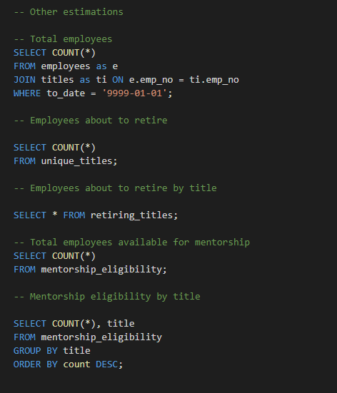
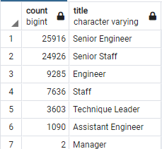
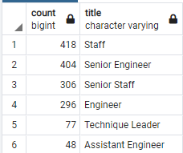

# Pewlett Hackard Analysis

## Pewlett Hackard Overview
We are working with Pewlett Hackard, a company with several thousand employees, some of them which are about to retire. The impact of such upcoming retirements, or what Management calls the "silver tsunami", will have several implications, such as meeting retirement packages, job openings and develop mentorship programs. 

In this specific analysis, we are working with Bobby, an HR analyst that is performing employee research and we will help him to build an employee database using SQL. Our objective is to:
1. Determine total number of employees that are close to retire and its breakdown by position
2. Determine total number of employees who are eligibile for mentoring and its breakdown by position

Finally, for this analysis we determined that employees who are close to retire are the ones born between 1952 and 1955, and the ones eligible to participate in the mentorship program are the ones born in 1965.

## Pewlett Hackard Results
The main takeaways from the analysis are the following:
1. There are approximately 240,000 employees
2. There are approximately 72,500 employees who are about to retire (~30% of total workforce)
3. The breakdown by title of employees who are about to retire is the following:
   - Senior Engineer: 25,916 (35.7% of employees who are about to retire)
   - Senior Staff: 24,926 (34.4% of employees who are about to retire)
   - Engineer: 9,285 (12.8% of employees who are about to retire)
   - Staff: 7,636 (10.5% of employees who are about to retire)
   - Others: 4,695 (6.6% of employees who are about to retire)
4. There are 1,549 employees who are eligible to participate in the mentorship program, the breakdown by title is the following:
   - Staff: 418 (26.9% of employees eligible for mentorship)
   - Senior Engineer: 404 (26.0% of employees eligible for mentorship)
   - Senior Staff: 306 (19.7% of employees eligible for mentorship)
   - Engineer: 296 (19.1% of employees eligible for mentorship)
   - Others: 125 (8.0% of employees eligible for mentorship)

## Pewlett Hackard Summary
Based on our analysis, we consider that the Company will face the folllowing as a result of the 'silver tsunami':
1. There are about 72,500 employees who are about to retire (~30% of total workforce) and that need to be replaced soon. The majoriy are Senior Engineers and Senior Staff
2. Considering the employees who are eligible to participate in the mentorship program and the employees who are about to retire, we obtain the following ratios by title:
   - Senior Engineer: 25,916 employees to retire / 404 potential mentors = ~65 new employees to be trained per mentor
   - Senior Staff: 24,926 employees to retire / 306 potential mentors = ~82 new employees to be trained per mentor
   - Engineer: 9,285 employees to retire / 296 potential mentors = ~32 new employees to be trained per mentor
   - Staff: 7,636 employees to retire / 418 potential mentors = ~19 new employees to be trained per mentor

Based on the former, it seems to be a very large shortage of potential mentors to train the new generation, specially at Senior Engineer and Senior Staff positions. Management will either need to increase the number of potential in-house mentors by training younger candidates or approach external parties that help them retrain the new employees. Aggresive actions have to be taken soon.

Below you find an image of our code and corresponding outputs that support the calculations used in the Summary.

SQL Code (for more detail refer to the Queries folder):

Employees about to retire by position:

Employees eligible to participate in the mentorship program by position:

